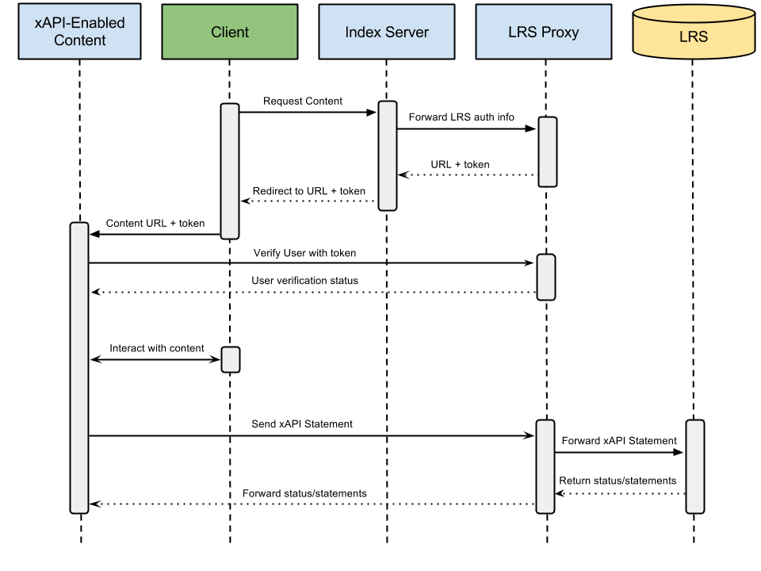

# Experience API Proxy

ADL's [Experience API](https://github.com/adlnet/xAPI-Spec) defines a language for learning content to communicate
training data about a learner to an external Learning Record Store (LRS). As a protocol it is perfectly adequate to get
data out of a piece of learning content. Logistically though, the learner has no way of knowing to what LRS the content
decided to publish his/her data to, without the learner explicitly providing the content with an LRS endpoint and
publishing credentials.

The Experience API Proxy project seeks a solution to this problem. It allows the learner (or the learning management
system) to register the LRS information with the proxy. The content can then make its xAPI requests to the proxy, and
the proxy will route the statements to the specified LRS. This amounts to live configuration of the content by external
systems or users without having to significantly change the content.

The proxy also stores learner information (specifically the "actor" envelope of the xAPI statement), so a learning
management system can provide that information to the content as well, without requiring the learner to re-submit it.

The basic data flow can be seen in the below graphic:
  

## Submitting LRS information

_Request:_

    POST /config

_Request body:_

    {
        "endpoint": "http://example.com/xapi/",
        "user": "bogusUser",
        "password": "ButteredCatParadox",
        "actor": {
            "name": "Steven Vergenz",
            "mbox_sha1sum": "d16681af53ecce8c2c650c5751575325af277cee"
        }
    }

* _endpoint_: The URL of the LRS.
* _user/password_: The basic auth credentials for the named LRS.
* _actor_: An xAPI-format actor block. See the Experience API [spec](https://github.com/adlnet/xAPI-Spec/blob/master/xAPI.md#actor)
    for the formatting of this object.

_Response:_

    hrsEhFvfNFXlIUkW

* A semi-unique token needed to reference the LRS information.

## Retrieving LRS information

For security reasons, you cannot recover all of the information POSTed to the proxy. However you can verify the
validity of the token, retrieve the actor info, and check the time until expiration.

_Request:_

    GET /config?lpt=hrsEhFvfNFXlIUkW

_Response:_

    {
        "actor": {
            "name": "Steven Vergenz",
            "mbox_sha1sum": "d16681af53ecce8c2c650c5751575325af277cee"
        },
        "expires": "2014-01-29T21:15:00Z"
    }

* _actor_: The _actor_ body provided in the initial registration.
* _expires_: The date/time when the LRS information will be deleted in ISO8601 format.

## Using the proxy

There are many ways to make use of the proxy, but generally speaking, you can treat the <code>/xapi</code>
endpoint as an LRS. You only need to add the <code>lpt</code> query argument to your requests, and the request
will be forwarded to the LRS associated with the provided token. For example, to
retrieve statements from the LRS by proxy:

_Request:_

    GET /xapi/statements?lpt=hrsEhFvfNFXlIUkW&since=2014-01-29T20:05:49.228Z

_Response:_

    {
        "statements": [],
        "more": ""
    }
